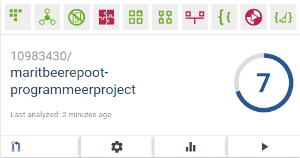

### Taken
Om dit cijfer te bereiken is vooral veel code verkort en is meer code opgedeeld in aparte functies (ik begon namelijk met een 4). Het ging vooral om lange functies om dingen in de FireBase te zetten en eruit te halen.