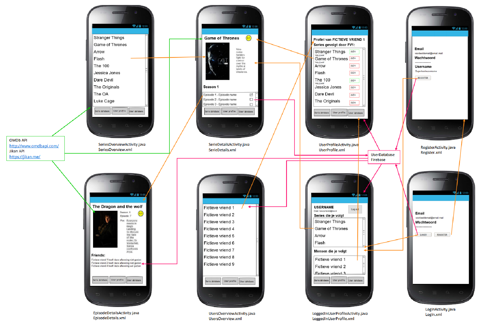
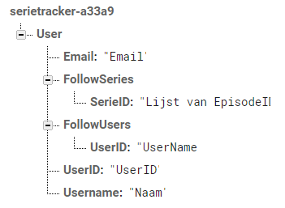

# Design document

## Advanced sketches
De onderstaande dataflow geeft aan hoe de activities in elkaar over lopen, hoe de data uit de API wordt gehaald en hoe de data uit Firebase wordt gehaald.
De roze pijlen geven aan wat er uit firebase wordt gehaald en wordt opgeslagen (te zien aan de richting van de pijl). De groene pijlen geven aan welke informatie uit de API wordt gehaald. De oranje pijlen geven aan hoe de flow tussen de activities zal worden. Onderin elke activity staat een bottom navigation, flows naar de activities hiervan zijn weggelaten in de sketch om het nog een beetje overzichtelijk te houden.  
Helaas verlaagd git de resolutie nogal, hier is een link naar een plaats met een hogere resolutie: https://imgur.com/HY50UZA.

## Diagram of utility modules

## List of APIs and frameworks/plugins
- **OMDb API/The open movie database**: http://www.omdbapi.com/  
Dit is een API die informatie bevat over series, seizoenen en episodes. Het bevat daarnaast ook informatie over films, maar ik ben niet van plan om die te gaan gebruiken.
- **Jikan**: https://jikan.me/   
Dit is een API die anime bevat. Niet alle animes staan in de andere API, waardoor deze API de app vollediger maakt.
- **Firebase**: Firebase wordt gebruikt om de informatie van de gebruikers op te slaan.
- **Picasso**: Wordt gebruikt om plaatjes van de series in te laden.

## Data sources
De datasources zijn de APIs, OMDb & Jikan.

## Database tables and fields
De database zal er zoals hieronder uitzien:  
  
Er is te zien dat de email, de username, de users die een gebruiker volgt en de series die een user volgt opslaat. Bij de series die een gebruiker volgt wordt in de lijst van episodes opgeslagen welke gekeken zijn, per serie. Waar 'User' staat zal een door firebase gegenereerd ID komen te staan. Dit ID wordt gebruikt bij FollowUsers om bij te houden welke gebruikers user volgt.

  
