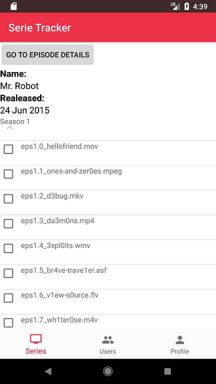

# Process book

## Week 1

### Maandag 8 januari 2018  
- Werken aan propasal  

### Dinsdag 9 januari 2018  
- Werken aan design document  

### Woensdag 10 januari 2018
- Project opgezet in android studio
- Data uit de APIs gehaald (nog zonder te strippen)
- Firebase geconnect
- Design document afgemaakt
- Begonnen aan login & register

### Donderdag 11 januari 2018
- Login en register mogelijk
- Firebase opgezet
- Listview series overzicht gemaakt
- Bottom navigation gemaakt
- Fragments toegevoegd
- Begonnen aan fragments voor de episode details, user details, serie details
- Prototype waardige app gemaakt door navigatie te fixen en data in te laden
- **Keuze:** Ik heb er voor gekozen om met fragments te werken zodat bottom navigatie mogelijk is.

### Vrijdag 12 januari 2018
- Vandaag niet veel meteen zichtbare veranderingen, maar idee en problemen uit prototype goed geanalyseerd
- Layout veranderingen
- Firebase structuur aangepast na feedback presentaties
- Nagedacht en plan gemaakt over hoe het mogelijk wordt om mensen te volgen
- **Keuze:** Ik heb ervoor gekozen om 'vrienden' te kunnen volgen in plaats van als vriend te kunnen toevoegen op basis van een verzoek. Hier is voor gekozen zodat er in theorie bijvoorbeeld ook bekende mensen kunnen worden gevolgd, zonder dat deze persoon iedereen moet terug volgen.

### Zondag 14 januari 2018
- Login bug gefixt
- Bug gefixt dat het registerfragment en het login fragment 'achter elkaar' komen in plaats van 1 van de twee
- Bug gefixt dat niet alle informatie in de listview komt
- Episode Details pagina gemaakt, dus data opgehaald, geparsed en in een fragment geplaatst
- Begonnen aan user database fragment en informatie uit Firebase halen
- Begonnen aan expandable listview
- Plan van aanpak voor komende week gemaakt

## Week 2

### Maandag 15 januari 2018
- User database gemaakt aan de hand van usernames uit Firebase
- Data API uitgelezen en begonnen met parsen voor de expandable list view van de season nummers en episode nummers
- Toestenbord bug gefixt bij de listview zoek functie
- Bug gefixt dat de listview weer clickable is na het terug gaan naar het fragment
- Opmaak row layout
- **Keuze**: Ik heb er voor gekozen om de episode nummers en seizoenen samen in een expandable listview te zetten. Dit zodat er niet nog een aparte seizoen fragment hoeft te zijn.

### Dinsdag 16 januari 2018
- Eindelijk voor elkaar gekregen om alle JSON data uit te lezen in classen en te zorgen dat automatisch alle informatie van elke seizoenen opgehaald wordt zonder elke seizoen url te hardcoden.
- Expandable listview werkend gekregen. Echter nog niet met de goede data, seizoenen er wel al ingekregen, episodes nog niet. 

 

### Woensdag 17 januari 2018
- Vandaag de hele dag bezig geweest met informatie in het goede format de expandable listview in krijgen. Dit lukte helaas niet heel goed, ik ben tegen heel veel bugs aangelopen. Momenteel heb ik de data in een Arraylist met class objecten gekregen. 

### Donderdag 18 januari 2018
- **Opmerking:** Ik heb helaas vandaag niet veel kunnen doen. Nadat het dak van de UvA afvloog heb ik er door de storm ongeveer 6.5 uur over gedaan om thuis te komen (ik was 18.00 pas thuis). Als je denkt dat de NS niet doet aan treinen laten aansluiten op elkaar heb je nog nooit met connexxion gereisd..
- Kleine aanpassingen gedaan aan de serie overview pagina
- Helaas tegen een bugg aangelopen dat de Expandable Listview niet altijd laadt

### Vrijdag 19 januari 2018
- Helaas nogsteeds de expandable listview niet helemaal werkend gekregen. Loop ook tegen een bug aan dat de expandable listview niet tevoorschijn komt. Echter is deze wel te zien wanneer er naar een andere fragment wordt gegaan en vervolgens weer terug naar de serie details. Hard aan het werk aan dit te fixen.
- Veel moeite gedaan om de hashmap werkend te krijgen, maar het is nog niet helemaal gelukt. Het gaat met baby stapjes.

### Zaterdag 20 januari 2018
- Hashmap met data voor expandable listview gefixt
- Data in expandable listview weergeven
- **Keuze:** Elke episode heeft een imdbrating, maar bij sommige is de waarde "N/A". Er is hierom gekozen om hier toch maar een String van te maken in plaats van een double, aangezien er geen berekeningen met de rating zullen worden uitgevoerd.
- Bug gefixt dat de expandable listview niet altijd tevoorschijn komt
- Checkboxes aan de expandable listview toegevoegt
- Expandable listview is clickable, er kan dus op een item in de listview geclickt worden en naar de episode details gegaan worden
- **Problemen:** Hoe kan je zien in een expandable listview of er op een checkbox geklikt is?
- Informatie over episodes die gezien zijn in Firebase gekregen   

## Week 3

### Maandag 22 januari 2018
- Vandaag liep ik helaas tegen een database probleem aan. Wanneer er een season wordt geinput met de format "1", denkt Firebase dat dit deel uitmaakt van de arraylist en er dus een 0 mist (aangezien firebase zelf nummers gebruikt om waardes van arraylisten te weergeven in de webversie).
Ik heb er hierom voor gekozen om seizoenen in Firebase te zetten met "S-[seizoennummer]" en "E-[episodenummer] (bijv. E-22 voor episode 22). Deze waarde kan dan met een regex split worden gescheiden van de letter die ervoor staat en daardoor later worden gebruikt bij het aangeven van welke episodes wel en niet gezien zijn. Het plaatje hieronder laat dit iets duidelijker zien.

## Week 4
