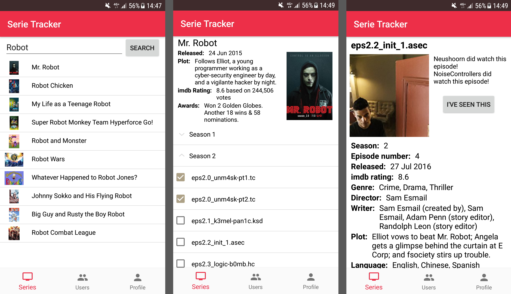
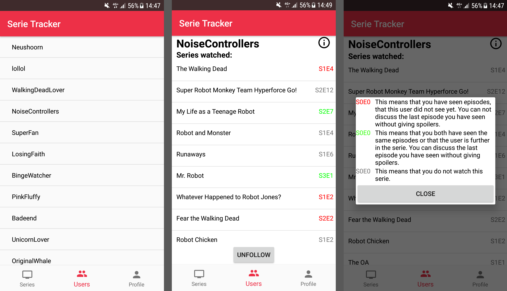
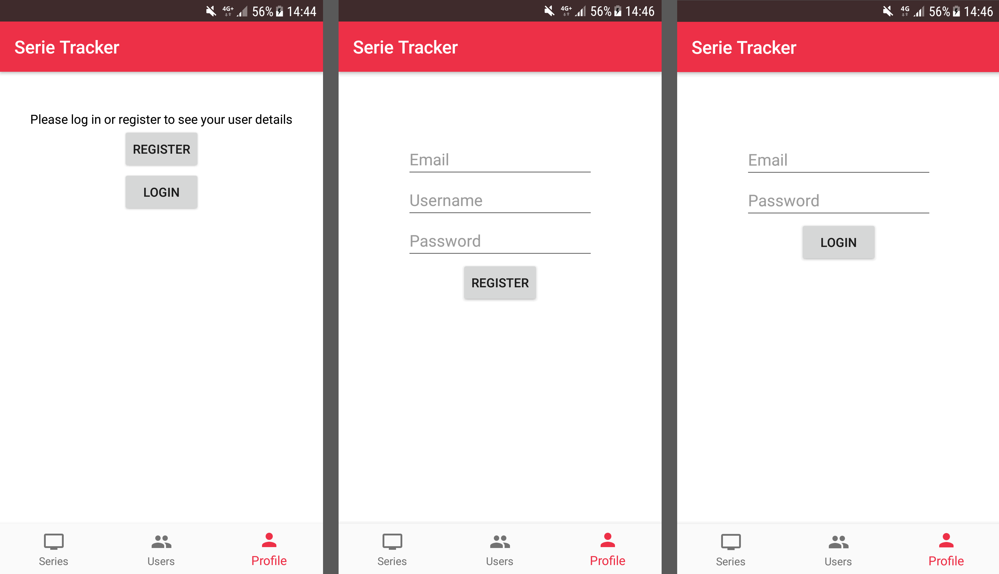
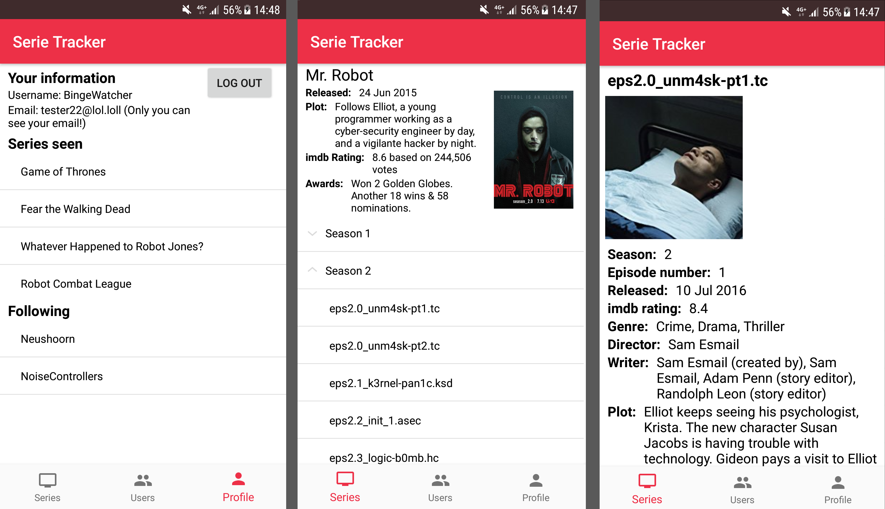

# Serie tracker
**Marit Beerepoot, 10983430**

## Beschrijving
Deze applicatie maakt het mogelijk om bij te houden wat de laatste aflevering is die gezien is van een serie. Daarnaast geeft het ook de basis informatie weer over de serie en de episodes, zoals het plot en de imdb rating. Door middel van een zoekfunctie kunnen series worden gevonden. Bovendien is het ook mogelijk om gebruikers te volgen. 
Gebruikers kunnen worden gevonden in een overzicht van de gebruikers. De app voorkomt ook dat de gebruiker spoilers geeft zijn vrienden. Dit doet de app door op de pagina van gebruiker informatie met kleuren aan te geven of de ingelogde gebruiker kan praten over de episode met de bekeken gebruikers. De tot nu toe bekeken series en gevolgde gebruikers worden weergeven in een overzicht van informatie van de ingelogde gebruiker, zodat deze niet steeds in de 'database' hoeven worden terug gevonden.

## Features
- Database waar bijna alle series in te vinden zijn
- Mogelijkheid om door de serie database heen te zoeken
- Mogelijkheid om episodes te markeren als gezien, waardoor je nooit meer kwijt raakt waar in een serie je bent
- Mogelijkheid om vrienden te volgen en te zien waar je vrienden in een serie zijn
- Serie details en episode details kunnen bekeken worden
- App kan bekeken worden zonder in te loggen, maar dan kunnen er geen users gevolgd worden of episodes als gezien worden gemarkeerd

## Doel
### Probleem beschrijving
Het doel van de app is om de volgende problemen op te lossen:
1. Niks is vervelender dan telkens maar weer in je browser geschiedenis terug te moeten zoeken wat de laatste aflvevering is die je hebt gekeken van de favoriete serie. Daarnaast wordt de struggle nog groter de verschillende platformen waarop series te bekijken zijn, waar de ene wel bijhoudt wat de laatst bekeken aflevering was, en de andere niet. Op het moment dat je je browser geschiedenis en coockies verwijderd wordt het nog erger: nergens is meer terug te vinden waar je was, wat resulteert in minuten tot uren lange zoektochten om te vinden waar je was. 
2. Het is ook super vervelend als je achterloopt met een serie kijken, en je vrienden, waar jij bij bent, over een aflevering gaan praten die je nog niet gezien hebt. Zonder dat je er om vraagt vliegen de spoilers om je oren.

### Doelgroep
De doelgroep is simpelweg iedereen die graag naar series kijkt en dat ook regelmatig doet. Om nog specifieker te zijn: mensen die series kijken en graag bijhouden waar ze in de serie zijn, of een hekel hebben aan het terug zoeken waar ze in een serie zijn. Daarnaast is een andere doelgroep ook vriendengroepen die afleveringen van series niet willen spoilen aan de rest van de groep. Over het algemeen is de doelgroep dus mensen die actief series kijken. 

## Video 
Komt later vandaag
[Klik hier om de demo op YouTube te bekijken](https://youtu.be/k1UjwAWjRzA)  

## Screenshots
v.l.n.r.: SeriesOverview, SerieDetails, EpisodeDetails   
  
  
v.l.n.r.: UserOverview, UserDetails, ColorDialogFragment  
  
  
v.l.n.r.: LoggedInUserInfo (als uitgelogd), Register, Login  
  
  
v.l.n.r.: LoggedInUserInfo (als ingelogd), SerieDetails (als uitgelogd), EpisodeDetails (als uitgelogd)  
  

## Sources
- [Firebase](https://firebase.google.com/) (Licensed onder Creative Commons Attribution 3.0 License)
- [Picasso](http://square.github.io/picasso/) (Licensed onder Apache 2.0)
- [The open movie database](http://www.omdbapi.com/)  (Licensed onder CC BY-NC 4.0.)
- [Volley](https://github.com/google/volley) (Licensed onder Apache 2.0)

## Better code hub

## Copyright
  Copyright 2018 Marit Beerepoot  

   Licensed under the Apache License, Version 2.0 (the "License");
   you may not use this file except in compliance with the License.
   You may obtain a copy of the License at

       http://www.apache.org/licenses/LICENSE-2.0

   Unless required by applicable law or agreed to in writing, software
   distributed under the License is distributed on an "AS IS" BASIS,
   WITHOUT WARRANTIES OR CONDITIONS OF ANY KIND, either express or implied.
   See the License for the specific language governing permissions and
   limitations under the License.

