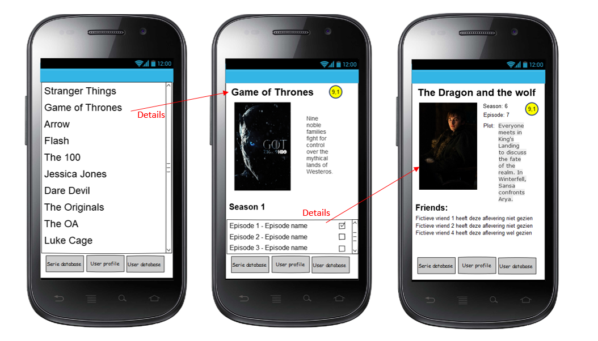
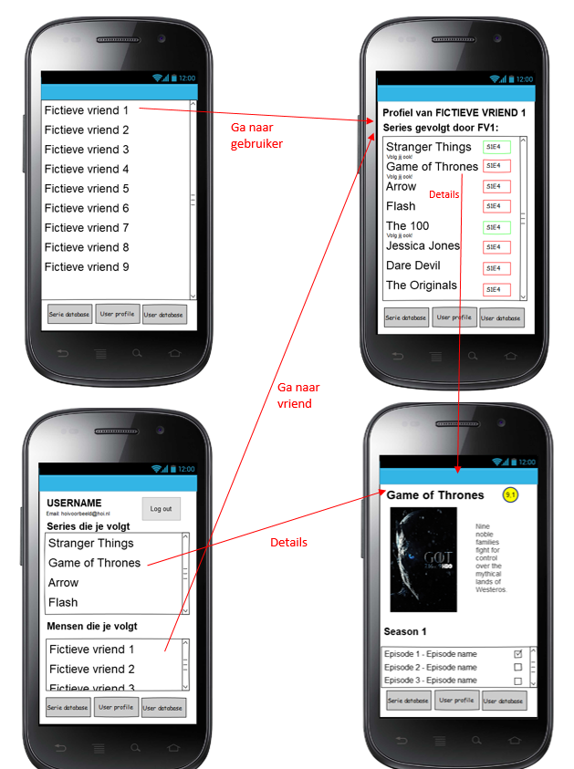
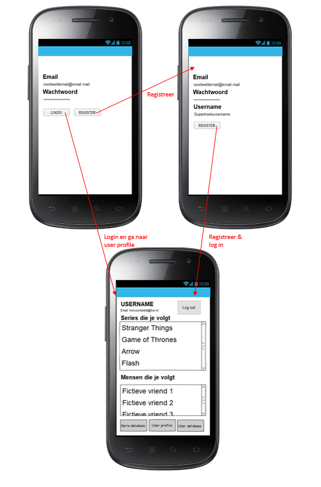

# Serie tracker
### Door:
Marit Beerepoot  
10983430

## Probleem beschrijving:
Het lost de volgende problemen op:  
1. Niks is vervelender dan telkens maar weer in je browser geschiedenis terug te moeten zoeken wat de laatste aflvevering is die je hebt gekeken van de favoriete serie. Daarnaast wordt de struggle nog groter met telkens verschillende platformen waarop series te bekijken zijn, waar de ene wel bijhoudt wat de laatst bekeken aflevering was, en de andere niet. Op het moment dat je je browser geschiedenis en coockies verwijderd wordt het nog erger: nergens is meer terug te vinden waar je was, wat resulteert in minuten tot uren lange zoektochten om te vinden waar je was. 
2. Het is ook super vervelend als je achterloopt met een serie kijken, en je vrienden, waar jij bij bent, over een aflevering gaan praten die je nog niet gezien hebt. Zonder dat je er om vraagt vliegen de spoilers om je hoofd.

## Doelgroep:
De doelgroep is simpelweg iedereen die graag naar series kijkt en dat ook regelmatig doe. Echter biedt de app ook informatie aan over series, waardoor het een doelgroep die meer informatie over series wilt ook aanspreekt. Daarnaast is een andere doelgroep ook vriendengroepen die afleveringen van series niet willen spoilen aan de rest van de groep. Over het algemeen is de doelgroep dus mensen die actief series kijken. 

## Oplossing:
Het idee is om een app te maken waarin je kunt bijhouden bij welke aflevering van een serie je bent. Daarnaast geeft de app informatie weer over de serie in het algemeen en over elke aflevering.  
De app zal ook een functionaliteit hebben waardoor er gezien kan worden bij welke aflevering mensen die je volgt zijn (bijv. je vrienden). Op deze manier kunnen mensen om je heen nooit meer spoilers geven omdat ze niet wisten dat je de aflevering nog niet gezien had!  
Het helpt ook bij het zoeken naar nieuwe series om te kijken, omdat je onder andere kan zien wat je vrienden kijken en er een database is om doorheen te zoeken.

#### Samenvatting oplossing:
De oplossing is een app die kan bijhouden wat de laatste aflevering is die je gezien hebt van een bepaalde serie.

#### Visual sketch
De volgende wireflow geeft aan wat er gebeurd wanneer een user begint bij de serie database. Hij kan details zien over de serie en over de episodes van de serie.  
  
De volgende wireflow geeft weer hoe een gebruiker bij een user profile van een andere user kan komen. Dit kan door de user in de user database te vinden (bovenste wireflow) of te kijken bij het user profile van de ingelogde user naar wie hij volgt. De episode nummers met het groene vierkant eromheen zijn episodes die de ingelogde gebruiker gezien heeft. De rode heeft de ingelogde gebruiker nog niet bekenen.  
  
De volgende wireflow geeft weer hoe een user inlogt.  
  
In de bovenstaande wireflows is het cijfer in de gele cirkel het IMDB cijfer. De checkboxen geven aan of een aflevering wel of niet bekeken is.

#### Main features:
- Database om series in te zoeken (**mvp**).
- Functionaliteit om aan te geven dat je een bepaalde aflevering hebt gezien (**mvp**).
- 'Database' om mensen in te zoeken.
- Mogelijkheid om mensen te kunnen volgen.
- Mogelijkheid om te zien wat de laatste aflevering is die een vriend/iemand die je volgt gezien heeft.

## Data sources:
De volgende API zal worden gebruikt:
- **OMDb API/The open movie database**: http://www.omdbapi.com/  
Dit is een API die informatie bevat over series, seizoenen en episodes. Het bevat daarnaast ook informatie over films, maar ik ben niet van plan om die te gaan gebruiken.

## External components:
De volgende external components worden gebruikt:
- Firebase (slaat bekeken afleveringen op en maakt volgen van gebruikers mogelijk).
- Picasso (voor het inladen van de afbeeldingen van episodes en series).

## Similar mobile apps:
- **TV Time: TV Show Tracker:** https://www.tvtime.com/en   
Deze app maakt het mogelijk om bij de houden bij welke aflevering van een serie je bent, maar is meer gericht op een planning. Het geeft namelijk een overzicht van welke series wanneer op tv komen en geeft een melding wanneer er een nieuwe aflevering wordt uitgezonden. Daarnaast heeft het een 'Explore' sectie, waar informatie te vinden is over series. Deze is spoiler vrij gemaakt. Ten slotte is het mogelijk om te delen wat je van een bepaalde aflevering vond met andere serie kijkers op het platform. 
Om aan te geven of een aflevering gekeken is moet er worden ingelogd. Er wordt dus op basis van account opgeslagen welke afleveringen gekeken worden.
- **Hobi:** http://www.hobiapp.com/  
Hobi werkt vrijwel hetzelfde als TV Time. Het maakt het mogelijk om TV shows te volgen, af te tellen naar wanneer een aflevering op TV komt, stuurt notificaties wanneer afleveringen komen. Het verschil TV time is dat het niet mogelijk is om te delen wat je van een aflevering vond en dat het persoonlijke aanbevelingen geeft.

#### Hoe kan ik dit gebruiken?
Beide slaan account gebonden op welke afleveringen gekeken zijn. Dit kan ik ook realiseren via firebase. Echter zijn de andere functies, zoals meldingen geven wanneer een aflvering gaat worden uitgezonden en persoonsgebonden aanbevelingen geven, vrij complex en ben ik niet van plan dit te implementeren. 

#### Waarin onderscheidt deze app zich van de bestaande?
Deze app maakt het mogelijk om ook te zien waar vrienden zijn bij het kijken van een serie. Ik heb geen bestaande app kunnen vinden die dit ook doet.

## Hardest part:
Het moeilijkste wordt om het mogelijk te maken om mensen elkaar te laten volgen. 

## Better code hub:

